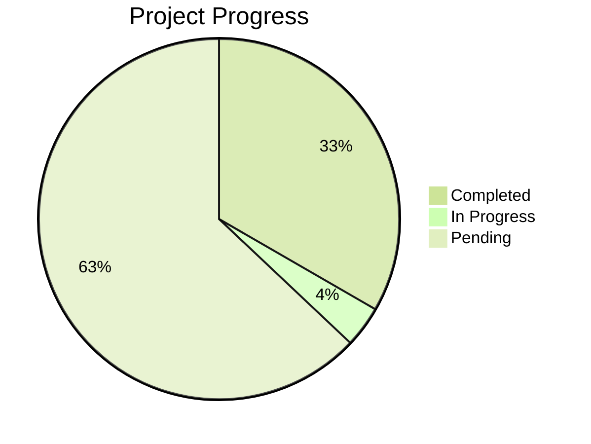

# ⚔️ D&D Combat Manager

A lightweight, local-first combat tracker to help DMs run faster, cleaner fights.  
Track initiative, rolls, and damage — all stored locally so your PCs never vanish.

---

## ✨ Features

- 📌 **Local-only**: runs in your browser, no server or signup required.
- 📝 **Persistent PCs/monsters**: state is auto-saved in `localStorage`.
- 🎲 **Attack + damage rolls** (with nat 20 / nat 1 highlights).
- 📖 **Readable combat log**: shows attacker, defender, hits/misses, damage, deaths.
- 🔄 **Export/Import JSON**: share encounters or back up progress.

---

## 🚀 Getting Started

1. Clone the repo:

   ```bash
   git clone https://github.com/farzamsh/FineIllDoItMySelf.git
   cd FineIllDoItMySelf
   ```

   or

   ```bash
   ssh -T git@github.com
   git clone git@github.com:farzamsh/FineIllDoItMySelf.git
   cd FineIllDoItMySelf
   ```

2. Install dependencies:

   ```bash
   npm install
   ```

3. Run the dev server:

   ```bash
   npm run dev
   ```

4. Open in your browser at:
   ```
   http://localhost:5173/
   ```
   (or whichever port Vite shows).

---

## 👤 Adding Your Players

Player characters (PCs) are defined in the initial state file (e.g. `src/state.ts` or `app.tsx`).  
Update the `INITIAL` object to include your party:

```ts
const INITIAL: AppState = {
  combatants: [
    {
      id: "1",
      name: "Thorn the Fighter",
      team: 1,
      hp: 34,
      ac: 16,
      init: 14,
      mod: +5,
    },
    {
      id: "2",
      name: "Lyra the Wizard",
      team: 1,
      hp: 22,
      ac: 13,
      init: 12,
      mod: +3,
    },
  ],
  round: 1,
  activeId: null,
};
```

💡 **Tip:** PCs and monsters are saved automatically in `localStorage`.  
To keep backups or share with friends, use **Export JSON** in the app.

---

## 💡 Why We Built This

As DMs, we wanted combat to feel fast and cinematic — not bogged down by dice math and initiative chaos.  
Most online tools were too heavy, so we made something **simple, local, and customizable**.

---

## 📜 License

MIT — free to use, modify, and share.

---

## 🤝 Contributing

Pull requests are welcome!  
If you have ideas for new features or better UI for logs, feel free to open an issue.

---

## 🗂️ Project Plans & Progress

### Phase 1: Core Combat Foundation

**Stages 1-2** - Establishing the fundamental combat mechanics and user experience  
_Building the essential framework for tactical encounters with intuitive controls and seamless gameplay flow_

#### Stage 1: Core Combat Mechanics & Manual Systems

_Laying the groundwork with essential combat features and flexible manual controls_

1. ✅ Fixed forced log clearance when switching to roster
2. ✅ Implemented Advantage and Disadvantage system for attacks
   - ✅ Integrated into attack cards
   - ✅ Added to combat logs
3. ✅ Enhanced attack workflow with two-step process
   - ✅ Built new attack card with dice preview and modification options
   - ✅ Added dice format support for manual modifiers
   - ✅ Refactored codebase and removed legacy systems
   - ✅ Improved attack card user interface
4. ✅ Added saving throws to character sheets
5. ✅ Implemented multiple attack types (Attack Roll, DC-based, Auto Hit)
   - ✅ Integrated into roster cards
   - ✅ Added to action cards
     - ✅ Auto Hit logic and interface
     - ✅ Save DC logic and interface
   - ✅ Updated combat log display
6. **In Progress** - Multi-target selection for area effects and spells

#### Stage 2: Enhanced User Experience & Gameplay Polish

_Refining the interface and adding quality-of-life improvements for smoother sessions_

1. Editable initiative tracking with manual adjustments
2. ✅ Added healing action type
   - ✅ Integrated into roster management
   - ✅ Added to action card system
3. Hidden mode for Game Master projection (concealing enemy HP/AC)
4. Critical success/failure automation (Natural 1/20 effects)
5. ✅ Unified button design system and visual consistency
6. ✅ Improved roster card layout in action sections
7. Action card interface optimization and visual hierarchy

#### Stage 2.5: Testing, Refinement & Technical Debt Resolution

_Dedicated period for bug hunting, UI polish, code optimization, and addressing technical debt accumulated during rapid development_

- Logic & Core Mechanics
  1. Re-Roll button functionality
  2. Seperate functions of different action type in each stage
- Game Rule Compliance
  1. Maximum HP input validation and data integrity
- UI/UX Issues & Polish
  1. Streamlined target selection (removed AC clutter)
  2. Display target AC and saving throw modifiers in combat interface
- Code Quality & Architecture
  1. Component Refactoring of Battle View
  2. Component Refactoring of Roster Manager
  3. Remove deprecated legacy code
  4. Consolidate duplicate utility functions

---

### Phase 2: Advanced Automation & Character Development

**Stages 3-4** - Expanding character capabilities and system automation  
_Enhancing character depth with sophisticated actions, comprehensive sheets, and intelligent rule enforcement_

#### Stage 3: Advanced Actions & Character System Expansion

_Introducing complex combat options and foundational automation systems_

1. Specialized templates for diverse attack and spell types
2. Multi-attack sequences within single action cards
3. Default weapon and spell libraries for quick setup
4. Custom weapon/spell builder with conditional effects and combo systems
5. Core combat maneuvers (Grapple, Shove) and associated skill checks
6. Comprehensive ability check system with proficiency and advantage support
7. Turn management system with action economy tracking

#### Stage 4: Complete Character Automation & Feature Integration

_Full character system implementation with automated rule enforcement and condition tracking_

1. Complete character features and class ability integration
2. Condition system with automated mechanical effects
3. Feat, class, and subclass feature implementation and automation
4. Inventory management with magical items, attunement, and charge tracking

---

### Phase 3: Multiplayer & Future Expansion

**Stages 5+** - Enabling collaborative play and long-term growth  
_Preparing for shared experiences with role-based access and laying groundwork for future innovations_

#### Stage 5: Multi-User System & Access Control

_Building collaborative features for shared campaign management_

- **Planning** - Multi-account support with authentication system
- **Planning** - Role-based permissions (Player, Game Master, Observer)
- **Planning** - Real-time synchronization for shared combat sessions
- **Planning** - Campaign management and user invitation systems

#### Stage 6: Future Innovations & Ecosystem Growth

_Exploring advanced features and community-driven development_

✨ _The adventure continues! Countless ideas await once we conquer these foundational quests. Focused execution first, then we'll embark on new horizons!_

---

## 📊 Progress Summary

- **Completed:** 9 items
- **In Progress:** 1 item
- **Pending:** 17 items
- **Success Rate:** 35% complete



_Last updated: Oct 7_
